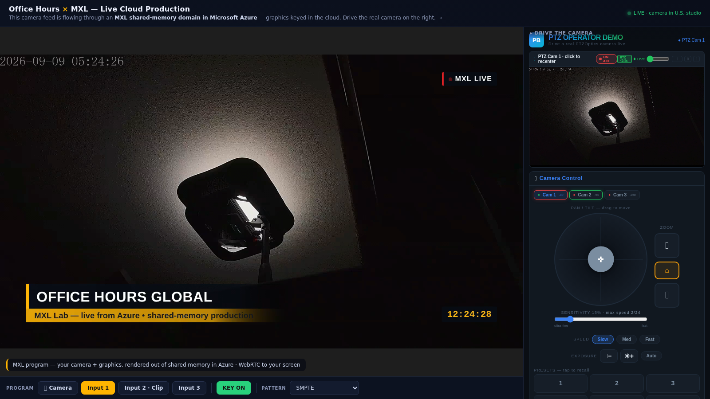
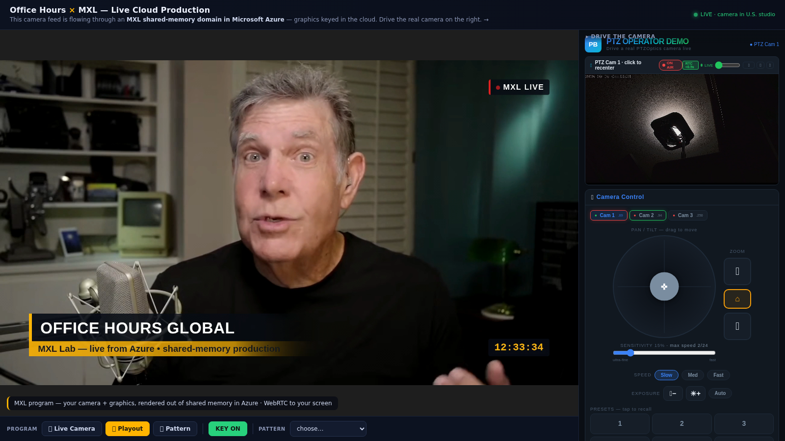

# MXL Cloud Production Demo

**A complete live broadcast production — real PTZ camera, file playout, test patterns,
graphics keyer, program audio — running through an [EBU MXL](https://github.com/dmf-mxl/dmf-mxl)
shared-memory domain on a small Azure cluster (production VM ~$0.77/hr), controllable by anyone with a browser.**

Built by [Office Hours Global](https://officehours.global) ahead of IBC 2026 to show that
the Dynamic Media Facility vision isn't just for broadcasters with NVIDIA partnerships —
one person can stand up cloud shared-memory production in a weekend with the open tooling.

**🔴 Try it live: [prodbots.com/mxl.html](https://prodbots.com/mxl.html)** — cut the
program, change patterns, and pan the *real* camera in the studio. No login. (Running
through IBC 2026; be kind, it's one VM.)


*Live PTZ camera (US studio) → SRT → MXL domain in Azure → HTML5 graphics keyed in-cloud →
WebRTC to the browser. The visitor pans the real camera from the right-hand console.*


*One click later: real episode playout through the same shared-memory chain, audio following the cut.*

## What it demonstrates

- **Remote camera as a first-class MXL source.** RTSP/SRT contribution lands in the domain
  with its grain index aligned to locally-generated flows, so a remote camera is an
  *instantly-cuttable* selector input (~30 ms cuts, graphics stay up). See
  [`tools/cam_ingest.py`](tools/cam_ingest.py) and the timing discussion in
  [`docs/FINDINGS.md`](docs/FINDINGS.md).
- **Audio-follow-video** assembled inside the domain by a fourth writer
  ([`tools/audio_pgm.py`](tools/audio_pgm.py)): episode audio on playout, bars-and-tone on
  pattern, silence on camera.
- **Sub-second glass-to-cloud-graphics latency**, proven by the camera's burnt-in clock and
  the cloud-keyed clock reading the same second in a single frame.
- **The DMF white paper's use cases in miniature**: "minimise small-site footprint",
  "shipping compute", "outsourcing peaks", and (deallocate when idle) "supporting
  sustainability" — on a general-purpose VM with zero specialised hardware.

## Architecture

Three machines, two sites, one shared-memory domain:

```
┌─ US STUDIO ────────────────────────┐      ┌─ AZURE VM (D8s_v5, Ubuntu 24.04) ──────────────┐
│                                    │      │                                                 │
│  PTZ camera (VISCA + RTSP 1080p60) │      │  mediamtx ◄─SRT─┐    ┌────────────────────────┐ │
│        │ RTSP                      │      │      │ RTSP     │    │  MXL domain (/dev/shm) │ │
│        ▼                           │      │      ▼          │    │                        │ │
│  Relay/kiosk box (Linux)           │      │  cam_ingest.py ─┼──► │ CAM Live               │ │
│   ├─ ffmpeg re-encode 1080p30 ─────┼─SRT──┼─────────────────┘    │ Clip Video/Audio ◄──── │ │ file-player (episode)
│   ├─ Express backend:              │      │  audio_pgm.py ─────► │ PGM Audio              │ │
│   │    /api/mxl/* control proxy    │      │  test-generator ───► │ TG Video/Audio         │ │
│   └─ serves mxl.html (kiosk page)  │      │                      │                        │ │
│                                    │      │  input-selector ◄──► │ Selector PGM           │ │
└────────────────────────────────────┘      │  html5-keyer ◄─────► │ Keyer PGM              │ │
                                            │  mxl2webrtc ◄──────── └───────────────────────┘ │
        Viewer's browser                    │      │                                          │
        ─────────────────                   │      ▼                                          │
        page + WHEP signaling ◄──named──────┼── mediamtx :8889                                │
        (https, Cloudflare      tunnel      │                                                 │
         tunnel, stable URL)                │                                                 │
        media (RTP) ◄───direct UDP 8189─────┼── (NSG: media port open; control ports locked)  │
                                            └─────────────────────────────────────────────────┘
```

Note the split delivery path: the player page and WHEP signaling ride a named
Cloudflare tunnel (stable HTTPS URL, survives reboots via systemd), while WebRTC
*media* flows directly to the VM's IP — so only the media port is internet-open
and every control surface stays IP-locked.

## Update: it's a three-VM fabric cluster now

The Fabrics API experiment landed. The same live program (camera + keyed
graphics, produced on VM1) now **crosses hosts through the MXL Fabrics API**
(TCP provider) and is served out of a *different VM's* shared memory:

**🔴 Watch the fabric-delivered program: [fabric-feed.cochran.cloud/mxl2webrtc/](https://fabric-feed.cochran.cloud/mxl2webrtc/)**

```
        VM1 "production" (D8s_v5)          VM2 "fabric peer" (D8s_v5)
        ┌─────────────────────────┐        ┌──────────────────────────┐
        │ camera/playout/patterns │ fabric │ domain (/dev/shm)        │
        │ selector → keyer → PGM ─┼─(tcp)─►│  "VM1 Program via        │
        │ domain (/dev/shm)       │  ~1.3  │   Fabric" → mxl2webrtc ──┼─► public viewer
        │      ▲                  │  Gbps  │                          │   (named tunnel)
        │      └── TG return leg ◄┼────────┼── test-generator         │
        └─────────────────────────┘        └──────────────────────────┘
                   │ fabric (tcp, via PUBLIC IP — sockaddr patched)
                   ▼
        VM3 "network island" (D4s_v5, its own unpeered VNet)
        ┌─────────────────────────┐
        │ domain ← same program   │  ← proves the cross-region/cross-cloud
        │ mxl2webrtc viewer       │    recipe: only the address changes
        └─────────────────────────┘
```

Measured: **30 grains/s sustained (1080p30 v210, ~1.3 Gbps), zero drops over
100k+ grains, initiator ~10% of one core, receiving host ~0% CPU** — remote
writes really do land without target CPU involvement. With both hosts on NTP,
the remote flow's head index matched the locally-generated flows, so the stock
input selector briefly cut the *fabric-delivered* flow on air. Whole cluster:
~$0.95/hr. Details and gotchas (libfabric ≥ 2.x required, TargetInfo sockaddr
patching for non-routed networks) in [docs/FINDINGS.md](docs/FINDINGS.md).

## Update 2: live MXL → TAMS record (EBU's two flagship projects, united)

The DMF white paper lists the MXL↔TAMS relationship as an open topic and notes
that *"MXL Grains can be grouped as TAMS Flow Segments."* We built it: the
fabric-delivered program on VM2 is cut into 1-second segments and registered —
with capture-derived TAI timeranges — into a **[TAMS](https://github.com/bbc/tams)
store** (Eyevinn [tams-gateway](https://github.com/Eyevinn/tams-gateway) +
MinIO + CouchDB) running on the island VM. The store's HLS endpoint plays any
timerange of the show **while it's still being recorded** — we pulled a frame
from 11½ minutes in the past whose in-picture cloud-keyed clock matched its
TAMS timerange to the second. Capture timing preserved from camera → fabric →
store → playback: live production into time-addressable storage, on the same
~$1/hr cluster. Bridge code: a ~90-line shipper (segment → presigned PUT →
`POST /flows/{id}/segments`) plus one ffmpeg segmenter. **Full replication
recipe — architecture, grain→segment mapping, and eight earned gotchas — in
[docs/TAMS.md](docs/TAMS.md).**

**🔴 Scrub the show while it's being recorded: [prodbots.com/mxl-tams.html](https://prodbots.com/mxl-tams.html)**
— the TAMS "time machine" side-by-side with the live program, **with live clipping**:
mark IN/OUT anywhere in the archive and the clip *already exists* — it's just a
timerange URL against the store (zero media copied). One click more muxes it to
a take-home MP4 by segment concat: a 15s clip of the live show exports in ~1.5s.
This is TAMS's reason to exist — live-to-clip while the event runs — working
against an MXL production. There's also a shared **clip bin**: saving a clip
creates a *new TAMS flow* that re-registers the same media objects under the
clip's timerange — zero bytes copied, and the store refcounts so deleting a
clip never touches the archive. Every visitor sees the same bin (it lives in
the store, not the browser).

Next on the bench: a **grain-native segmenter** — reading v210 grains straight
from the domain and grouping them into TAMS Flow Segments without the H.264
detour, i.e. the white paper's sentence implemented literally.

Runtime apps are the stock **[cbcrc/mxl-hands-on](https://github.com/cbcrc/mxl-hands-on)**
containers (test generator, file player, input selector, HTML5 keyer, mxl2webrtc),
orchestrated with **[CLOUDflex-broadcast/easy-mxl](https://github.com/CLOUDflex-broadcast/easy-mxl)**.
This repo adds the glue that made it a *usable remote production*:

| Piece | What it does |
|---|---|
| [`tools/cam_ingest.py`](tools/cam_ingest.py) | Low-latency RTSP→MXL ingest. 150 ms jitterbuffer, decode to v210, cadence-preserving PTS re-stamp so the remote camera's grain index aligns with local flows. **This is what makes cross-flow cutting of a remote source work.** |
| [`tools/audio_pgm.py`](tools/audio_pgm.py) | **Program audio mixer** (v2): GStreamer `audiomixer` over a live silence anchor + episode audio + per-guest audio, with per-input volume/mute driven from the kiosk's fader strip. Auto-adopts guest audio flows as contributors join. |
| [`tools/layout_pgm.py`](tools/layout_pgm.py) | **2-up / PiP compositor as a switcher input**: all six sources behind two selectors feeding a compositor; every layout change is a live pad-property flip, so the output flow is never recreated (wedge-proof). Five timestamp iterations documented in-file. |
| [`tools/guest_ingest.py`](tools/guest_ingest.py) | Open contribution: anyone's SRT (phone/OBS/vMix, any res/fps) conformed to 1080p30 v210, self-announcing so the slot goes live hands-off. |
| [`tools/guest_audio.py`](tools/guest_audio.py) | Contributor audio companion — pulls the guest's audio across the VNet into its own MXL flow for the mixer. |
| [`tools/mxl_thumbs.py`](tools/mxl_thumbs.py) | Multiview: per-input JPEG thumbnails rendered from raw grains (no decode), with content-hash detection of repeat-wedged readers. |
| [`tools/pgm_lite.py`](tools/pgm_lite.py) | 960×540 program copy (~0.33 Gbps) for fabric receivers behind GigE. |
| [`tools/patch-target-ip.py`](tools/patch-target-ip.py) | The dmf-mxl#714 NAT workaround as a tool: rewrites the sockaddr inside a fabric TargetInfo to a public IP. |
| [`tools/guest-leg-doctor.sh`](tools/guest-leg-doctor.sh) | 15s two-end healer for the guest fabric legs (initiator wedges *and* the target frozen-slices state). |
| [`tools/cam_relay.py`](tools/cam_relay.py) | The first-generation fixed-offset latency normalizer (superseded by `cam_ingest.py`, kept for the record — see FINDINGS). |
| [`backend/mxl-routes.js`](backend/mxl-routes.js) | Express routes proxying browser clicks to the pipeline APIs (cut / key / pattern / one-call cascade repair). |
| [`web/mxl.html`](web/mxl.html) | The kiosk page: WebRTC program feed + camera-control console + switcher bar. |
| [`web/lower-third.html`](web/lower-third.html) | Transparent OGraf-style lower-third + live clock + bug, rendered by the CBC HTML5 keyer's CEF. |
| [`scripts/bring-up-mxl.sh`](scripts/bring-up-mxl.sh) | One command from cold VM to running demo: containers → writers → ingest → selector → keyer → encoder → tunnel → page. |

## Update 3: a second camera, contribution-encoder style

The kiosk switcher now has a **Studio Cam 2** button: a static SDI camera
feeding a Haivision Makito X4, which calls into the cloud VM directly over
SRT (HEVC Main10 1080p30, 20 Mbps, deinterlaced on the encoder) and lands in
the MXL domain as its own v210 flow on selector slot 3 — the classic
broadcast-contribution pattern, terminated in shared memory instead of a
hardware decoder. Cuts to and from it are the same ~25 ms selector cuts.
See FINDINGS §8 for the decoder-threading and multi-slice gotchas this
surfaced, and §9 for why the feed runs video-only and the cam is H.264 (both
load-shedding decisions taken live while the demo was being shown).

## Update 4: the full facility (IBC week)

Everything above still runs — and grew into this. A day of live debugging with
real phone contributors, real visitors, and one full machine crash produced a
production facility that self-heals around contributor churn:

```
        CONTRIBUTION (anyone)                    PRODUCTION (VM1, D16s_v5, 16 cores)
┌────────────────────────────────┐      ┌───────────────────────────────────────────────┐
│ Studio PTZ cam  1080p60 H.264 ─┼─SRT──┼─► cam_ingest (frame-threaded decode, 60→30)   │
│  (camera-native, ZERO local    │ copy │                                               │
│   transcode, 20 ms latency)    │      │   MXL domain (/dev/shm) — one memory, 14 flows│
│ SDI cam2 → Makito X4 ──────────┼─SRT──┼─► cam2_ingest                                 │
└────────────────────────────────┘      │                                               │
┌────────────────────────────────┐      │   7-input selector ◄─ CAM·CAM2·Clip·TG·       │
│ Your phone: scan the Larix QR  │      │        │              Guest1·Guest2·Layout    │
│ on the kiosk page → app opens  │      │        ▼                                      │
│ pre-configured → tap = on air ─┼─SRT─┐│   layout_pgm: 2-up / PiP compositor           │
│ (OBS / vMix / ffmpeg too)      │     ││   audiomixer: episode + guest audio,          │
└────────────────────────────────┘     ││     per-input faders/mute on the kiosk        │
       VM2 "contribution host" (D8s_v5)││        │                                      │
      ┌────────────────────────────────┘│        ▼                                      │
      │ mediamtx :8890 (world-open SRT) │   HTML5 keyer (lower-third + clock)           │
      │  └► guest_ingest ×2 → v210 flows│        │                                      │
      │      │     ↑ guest-leg-doctor   │        ▼                                      │
      │      ▼     │ (15 s, heals both  │   encoder → mediamtx ─┬► WebRTC viewers       │
      │  MXL FABRIC legs (tcp) ─────────┼─►(forced IDR per cut) └► SRT egress:          │
      │      + audio pulled over VNet   │        │            `streamid=read:mxl2webrtc`│
      └─────────────────────────────────┘        ▼ PGM fabric leg (1.3 Gbps v210)       │
                                        └────────┼──────────────────────────────────────┘
       VM3 "island" (D4s_v5)                     ▼
      ┌──────────────────────────┐      VM2: segmenter+shipper ─► TAMS store on VM3
      │ TAMS: gateway+MinIO+     │      (12 h scrub/clip archive, storyboard sprites,
      │ CouchDB — 12 h archive   │       instant zero-copy clips + MP4 export)
      └──────────────────────────┘
```

What changed since the diagrams above:

- **The camera path lost its last transcode.** The PTZ's native 1080p60 H.264
  is copy-remuxed to SRT (20 ms latency; measured 6 ms site→Azure RTT) and
  decoded once, in the domain — pans are now butter, and the "relay box"
  re-encode that quantized network jitter into judder is gone.
- **Open contribution with scan-to-join.** The kiosk's "Send us your feed"
  panel carries per-slot Larix QR codes: a phone scans, the app opens with our
  SRT pre-configured, and the slot self-attaches — contributor audio joins the
  program mixer automatically. Contributions land on a *separate* VM and cross
  to production **over the MXL Fabrics API**, so the switcher host never
  decodes a stranger's stream.
- **Layouts as an input.** A 2-up/PiP compositor writes a "Layout" flow that
  the selector cuts like any camera, with a live preview panel while adjusting.
- **PVW/PGM buses with a live multiview** (grain-rendered thumbnails on every
  preview button) and **clean cuts** (a `/pipeline/keyframe` endpoint patched
  into mxl2webrtc forces an IDR at every cut — no mid-GOP smear).
- **Crowd-proof delivery.** One encode fans out to any audience; polling
  endpoints micro-cache (60 simultaneous thumbnail requests → 1 origin fetch);
  the whole kiosk — page, WHEP, thumbnails, TAMS playlists, presigned segments
  — is served **same-origin**, because venue networks that block unfamiliar
  domains are real.
- **Self-healing everywhere**, earned the hard way: watchdogs for wedged
  fabric readers (both failure species — silent *and* repeat-last-grain),
  frozen-slice targets, zombie relays, stale thumbnails, contributor churn.
  A full production-VM resize (8→16 cores) was recovered to on-air in ~7
  minutes, mostly by systemd.
- **Take our program with you:** any receiver can pull the finished program
  *today* via `srt://<vm>:8890?streamid=read:mxl2webrtc` — or go MXL-native
  and receive raw grains over the fabric:
  **[docs/JONAS-FABRIC-HANDOFF.md](docs/JONAS-FABRIC-HANDOFF.md)**.

## The hard-won lessons

The interesting engineering is in **[docs/FINDINGS.md](docs/FINDINGS.md)** — including:

1. Why a remote source stutters when cut in a grain-indexed shared-memory domain,
   and the cadence-preserving re-stamp that fixes it.
2. A measured case of the white paper's open topic *"robustness when Grains are missing"*
   (single-frame content flashes from stale ring slots) and the write-ahead margin that
   prevents it.
3. The GStreamer `rtspsrc` default 2000 ms jitterbuffer hiding inside `uridecodebin` —
   where almost all our latency was.
4. `mxlsink` requires an explicit `flow-id`; an empty one fails as a misleading
   `not-negotiated (-4)`.
5. Reader wedge on flow recreation, and the cascade-repair pattern that recovers.
6. Grain timestamps are **ring addresses**, not metadata: every writer needs an
   offset-locked, drift-bounded restamp — free-running counters and raw
   passthrough each fail in a distinct, delayed way.
7. The compositor's pad scaling runs in its single aggregation thread and caps a
   1080p30 chain below realtime — scale per-branch instead.
8. Wedged readers have TWO species: silent, and *repeating the last grain at
   full rate* — the second passes every liveness check except content hashing.
9. SRT latency is per-path physics: 20 ms is right for a 6 ms wired RTT and
   catastrophically wrong for cellular contributors (use ~1000 ms).

## Credits

- EBU DMF / MXL community — the [MXL SDK](https://github.com/dmf-mxl/dmf-mxl) and the
  Dynamic Media Facility white paper.
- CBC/Radio-Canada — the [mxl-hands-on](https://github.com/cbcrc/mxl-hands-on) media
  function containers.
- [CLOUDflex-broadcast/easy-mxl](https://github.com/CLOUDflex-broadcast/easy-mxl) — the
  control panel that makes the domain approachable.

MIT licensed. Not affiliated with EBU or CBC; all findings offered upstream with love.
